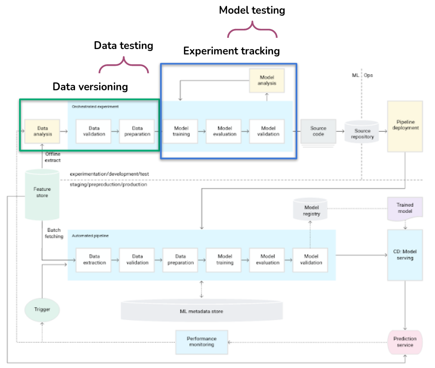
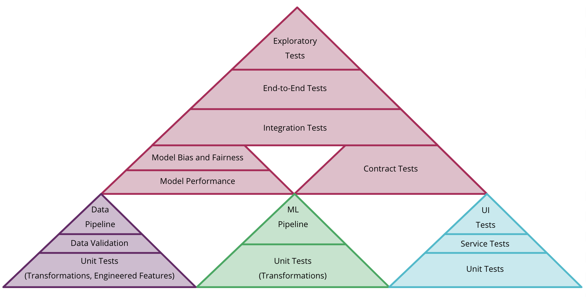
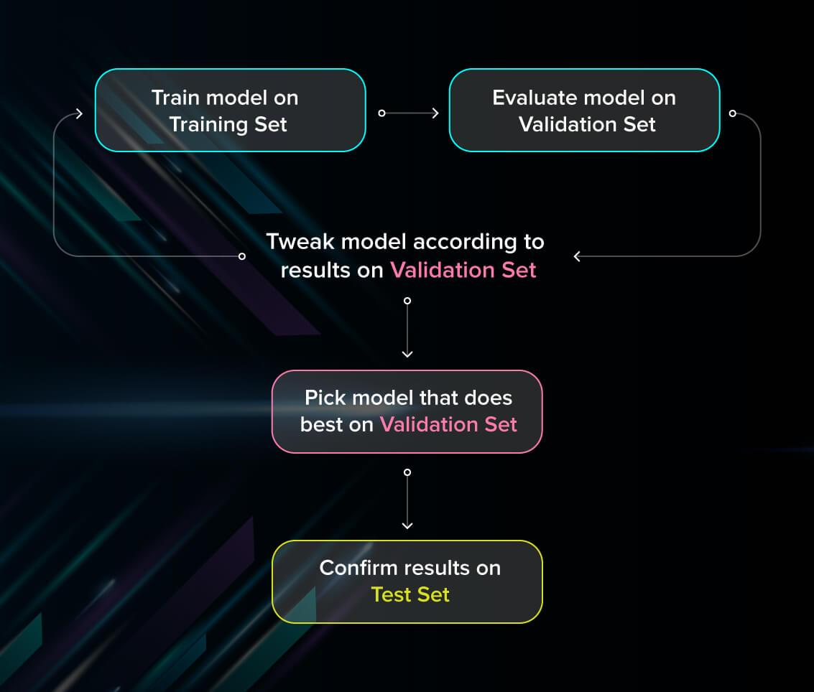
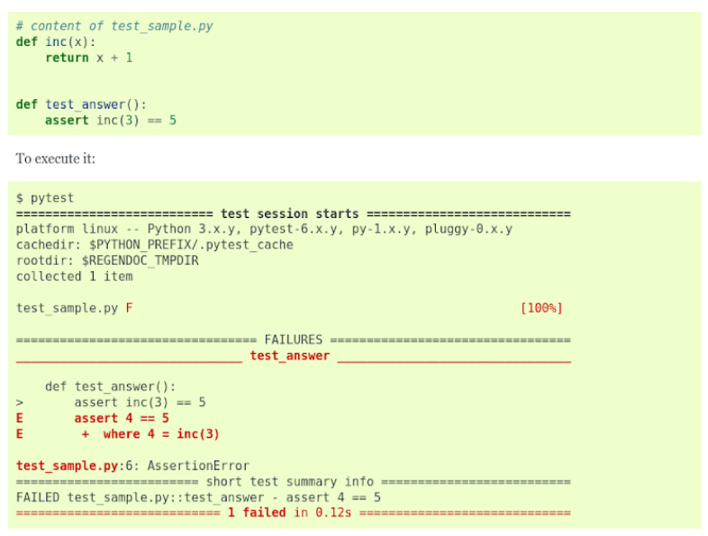

# Data and Model Testing

## Extension of 'Garbage in, garbage out' to ML systems

## Roadmap

## Tests everywhere

[Resource](https://research.google/pubs/pub46555/)

...but every test has its time

[Resource](https://martinfowler.com/articles/cd4ml.html)

## ML pipeline testing

- Goals of **software testing**:
  - Catch bugs early on
  - Assure that the software is behaving according to the requirements

**BUT**: behavior of the model is data-dependent and is based on learning (it’s not hard-coded)!

- Addition for **ML systems**:
  - The behavior needs to remain consistent during many calls
    - Non-deterministic algorithms (deep learning)

## Model testing

## Model evaluation

- Evaluate the capabilities of generalization (usual practice):
  - Cross-validation
  - Choose appropriate metric
- Good practice: split your dataset on **3 sets** (not on 2 which you always see in class!)

[Resource](https://serokell.io/blog/machine-learning-testing)

## Model validation

- **Logic of the algorithm** - do we always test it? (output length, range, intended overfitting…)  
  This type of test verifies the fundamental behavior of the model. It's not always systematically performed, but it's important to ensure the model functions as intended.
- Compare to a **baseline model** (better than random?)  
  The model's performance is compared to a simple baseline model (such as random prediction) to ensure that the model provides real value.
- **Invariance tests** - how much we can change the input without affecting the performance of the model. For example, if we run a pattern recognition model on two different photos of red apples, we expect that the result will not change much.
- **Directional expectation** tests - how perturbations in input will change the behavior of the model. For example, when building a regression model that estimates the prices of houses and takes square meters as one of the parameters, we want to see that adding extra space makes the price go up.
- **Minimum functionality** tests - test the components of the program separately just like traditional unit tests. For example, you can assess the model on specific cases found in your data.

[Resource](https://serokell.io/blog/machine-learning-testing)

## Data testing

- Raw data:
  - Null values: not allowed in target column
  - Schema
  - Range: outliers
  - Text: special symbols, capitalized letters
  - NLP: Content, language
- => **corrections** before non-conform data enters the pipeline and breaks it

- Processed data:
  - Distribution/range of engineered features
  - Normalization: range 0-1
  - Standardization: mean approx. 0
- => **correctness** of the transformations

## Training-serving skew

- After the test-train split
- Data for the training is not representative
  - Missing categories
  - Different ranges of numeric variables
  - Different quality of images or sound

## Tools

- Data:
  - Advanced data testing framework: [Great Expectations](https://greatexpectations.io/)
  - Generating synthetic data: [Trumania](https://github.com/RealImpactAnalytics/trumania) (and many others)
- Coding (unit testing):
  - [PyTest](https://docs.pytest.org)
  - [unittest](https://docs.python.org/3/library/unittest.html)
  - ...

## PyTest

[Reference](https://docs.pytest.org/en/6.2.x/)

---

*The content of this document, including all text, images, and associated materials, is the exclusive property of Adaltas and is protected by applicable copyright laws. Unauthorized distribution, reproduction, or sharing of this content, in whole or in part, is strictly prohibited without the express written consent of the author(s). Any violation of this restriction may result in legal action and the imposition of penalties as prescribed by law.*
